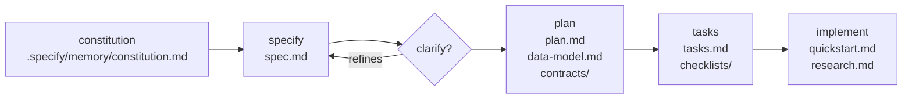
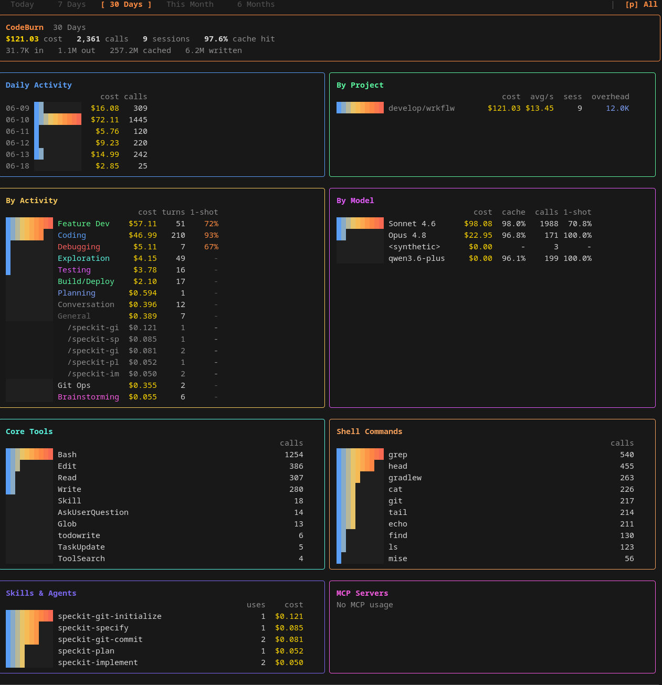

# Disclaimer

This is a playground to learn and demonstrate building a Kotlin/Vue web application with multi-agent coding.

> [!WARNING]
> This is not complete or fully correct — it's just the point where I stopped and moved on to digging into Kotlin again.

## Concept

The app handles generic workflows, starting with a document approval workflow. Built on Kotlin and Vue/[schwarzit's onyx](https://github.com/SchwarzIT/onyx), with [Temporal](https://temporal.io/) as the task orchestration sidecar.

The goal: build a spike from database to the first feature visible in the UI — fully tested, CI working, developer setup documented, and locally runnable in a few steps.

## Purpose

Demonstrate spec-driven agentic coding using GitHub's [spec-kit](https://github.com/github/spec-kit) and get back into Kotlin after a long time away from the ecosystem.

## Result

The current state was reached in roughly 4 days, about 12–13 hours of total work — most of it thinking and specifying rather than typing.

Most work was done by Claude Sonnet, with handoffs to my usual harness [opencode](https://opencode.ai) using Qwen or Kimi for cost reduction: planning and specs with Sonnet, implementation with Qwen or Kimi.

The first spec and setup took the most effort and needed some intervention to figure out where to start. After that, subsequent tasks — implementation, specs, plans, clarifications — needed almost no attention.

---

## Tooling Landscape

Here's a breakdown of the tools and technologies used across the five features built so far.

### AI / Agentic Coding

#### Spec-driven workflow: GitHub's [spec-kit](https://github.com/github/spec-kit)

- Enforces ground rules via a [constitution](.specify/memory/constitution.md)
- Spec-driven agentic development
- Test-driven agentic development

The Spec Kit lifecycle used in this repo:

#### Language specialists: [Voltagent](https://github.com/VoltAgent/awesome-claude-code-subagents/tree/main)

Occasionally used Voltagent specialists for review, discussion, and research on specific topics.

### Token Optimization

- [jcodemunch](https://github.com/jgravelle/jcodemunch-mcp)
- [ogham-mcp](https://github.com/cpolzer/ogham-mcp)
- [mem0](https://github.com/mem0ai/mem0)

### Numbers

Using [codeburn](https://github.com/getagentseal/codeburn) locally, exploring [Entire](https://entire.io/) for overall observability.

Interestingly, codeburn misses my running MCP servers and some skills (Voltagent language specialists). The costs shown assume API-based pricing rather than subscriptions.

---

### Backend (JVM / Kotlin)

- **Kotlin** — primary language
- **Hexagonal architecture** — domain, application, adapters, apps layers with strict boundary enforcement
- **Gradle** (Kotlin DSL, multi-module, build-logic convention plugins)
- **Temporal** — workflow orchestration (DocumentApprovalWorkflowImpl, workers, activities)
- **Ktor** — REST API layer
- **jOOQ** — type-safe SQL with code generation from schema
- **Flyway** — DB migrations (V1__, V2__, V3__)
- **Testcontainers** (2.0.5) — container-backed integration tests
- **Kotest** — assertion library
- **JUnit 5** — test runner

### Infrastructure

- **Docker / Docker Compose** — local services (Postgres, Temporal, Keycloak) + full-stack builds
- **PostgreSQL** — persistence
- **Keycloak** — identity (groups map to flow actor groups)
- **GitHub Actions** — CI pipeline

### Frontend

- **Vue 3** (Composition API) — UI framework
- **TypeScript** — strict typing throughout
- **Vite** — build tooling
- **Onyx** — component library
- **Pinia** — state management
- **Vue Router** — client-side routing
- **Vitest** — unit tests
- **Playwright** — E2E tests
- **oidc-client-ts** — authentication via Keycloak

### Developer Experience

- **mise** — tool version management + task runner (local/CI parity)
- **ktlint + detekt** — Kotlin linting / static analysis
- **ESLint** — TypeScript/Vue linting
- **MkDocs + Material** — documentation site (Python/uv)
- **speckit** — spec-driven workflow (spec → plan → tasks → implement)
- **pre-commit hooks** — quality gates on commit

### Architectural Patterns

- **Hexagonal / ports-and-adapters** — domain isolation
- **Outbox pattern** — reliable CloudEvents emission
- **CQRS-lite** — separate command/query use cases
- **Sealed classes** — typed result envelopes (`SubmitDocumentResult`, `SubmitterFlowsResult`)
