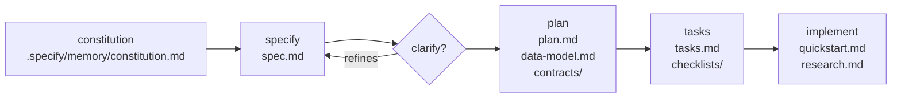

# Spec Kit Workflow

[Spec Kit](https://github.com/github/spec-kit) is a structured, spec-driven development lifecycle. Instead of jumping straight to code, it forces you to articulate *what* to build and *why* before deciding *how*.

In this project, every feature goes through the same lifecycle:

## Stages

### Constitution

The project constitution lives at `.specify/memory/constitution.md`. It defines the non-negotiable principles that every feature, every plan, and every agent must respect. It supersedes all other guidance.

In this project, the constitution enforces six principles:

| # | Principle | Short form |
|---|-----------|-----------|
| I | Hexagonal Architecture | `domain ← application ← adapters ← apps`. No framework/SQL in inner layers. |
| II | Test-First (NON-NEGOTIABLE) | TDD red→green→refactor. Tests are never optional. |
| III | Auditability | Every state change → immutable, ordered audit record. Append-only. |
| IV | Orchestration Behind a Port | `WorkflowEngine` port in domain. Temporal lives only in adapters. |
| V | Explicit Contracts & Consistency | Transactional outbox. Single effective decision under concurrency. |
| VI | Local Validation Before Push | `./gradlew build` must pass locally before any push. |

Run `/speckit-constitution` to create or amend the constitution.

### Specify

Write a **business-facing, technology-agnostic** feature specification in `specs/NNN-feature/spec.md`.

A good spec describes:

- The user stories (who does what, and why it matters)
- Acceptance scenarios (Given / When / Then)
- Functional requirements (what the system must do)
- Key entities (the domain vocabulary)
- Success criteria (measurable outcomes)
- Assumptions (what is out of scope)

The spec must not mention Kotlin, Temporal, jOOQ, or any other technology. Those decisions belong in the plan.

Run `/speckit-specify` with a plain-language feature description.

### Clarify *(optional but recommended)*

Before planning, surface ambiguities: edge cases that aren't covered, decisions that will force rework later, scope that's genuinely unclear.

`/speckit-clarify` asks up to 5 targeted questions and encodes the answers back into the spec. This is cheap — changing a spec before planning costs nothing; changing a plan mid-implementation costs a lot.

### Plan

Translate the spec into a **technology-specific design** in `specs/NNN-feature/plan.md`. This is where Kotlin, Temporal, jOOQ, Ktor, etc. are chosen and justified.

The plan also produces:

- `data-model.md` — entity relationships and database schema
- `contracts/lib/models.tsp` + `routes.tsp` — TypeSpec source (REST contract)
- `contracts/openapi.yaml` — generated from TypeSpec; consumed by docs and UI type generation
- `contracts/events.md` — integration event definitions (CloudEvents, prose format)
- `checklists/requirements.md` — FR/SC traceability matrix

Every plan must pass a **Constitution Check gate** before proceeding: each Core Principle is verified, and any deviation must be recorded with justification.

Run `/speckit-plan`.

### Tasks

Generate an ordered, dependency-aware `tasks.md` from the plan. Each task is:

- Small enough to be executed by a single agent in one session
- Self-contained with a clear done condition
- Ordered so dependencies are always satisfied before dependents

Run `/speckit-tasks`.

### Implement

Execute tasks one by one. The agent reads the task, writes a failing test, makes it pass, then refactors. Each task is marked done in `tasks.md` when complete.

Run `/speckit-implement`.

## Branch and Artifact Conventions

- Feature branches: `NNN-short-name` (e.g. `001-document-approval-engine`)
- All artifacts live under `specs/NNN-short-name/`
- Business specs are technology-agnostic; technology decisions live only in `plan.md`

## The Constitution (full text)

--8<-- ".specify/memory/constitution.md"
