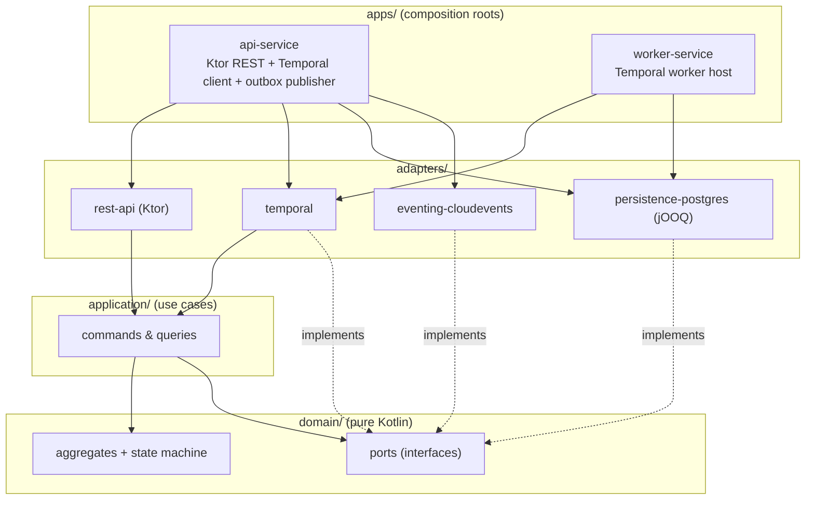
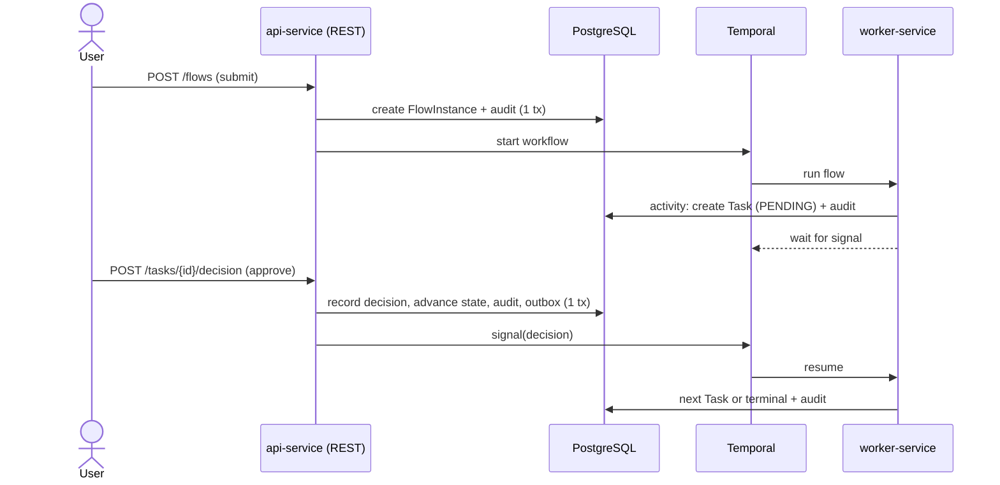

# Architecture Overview

wrkflw is a Kotlin/JVM Gradle multi-module monorepo built to **hexagonal (ports & adapters)**
architecture. The product is the *human-task domain* (flows, tasks, assignees, approvals,
audit); the durable orchestration substrate (**Temporal**) and the database (**PostgreSQL**)
are infrastructure behind ports.

## The layers



**Dependencies point inward only.** `domain` depends on nothing; `application` depends only on
`domain`; adapters depend on `application`/`domain` plus their own infrastructure library; the
two apps are the only modules that wire adapters to ports. A build-time boundary test
(Konsist/ArchUnit) fails the build if `domain` or `application` ever gain a Ktor/Temporal/jOOQ/
JDBC/DI dependency.

## Runtime flow (document approval)



The key split (**Approach A**): **Temporal owns orchestration position; PostgreSQL owns
human-task state, business data, and audit.** Human steps create DB rows and block on a Temporal
**signal**; REST actions validate domain rules, commit the authoritative DB transition, then
signal Temporal. See [Temporal integration](temporal-integration.md).

## Gradle module layout

The monorepo is a single Gradle build. `settings.gradle.kts` declares every module and includes
the `build-logic` composite build that supplies convention plugins:

```
wrkflw/
├── build-logic/               # composite build — convention plugins only
│   └── src/main/kotlin/
│       ├── kotlin-jvm.gradle.kts   # Kotlin + serialization + ktlint + detekt + Dokka
│       ├── testing.gradle.kts      # JUnit 5 + Kotest + Docker-proxy env var
│       └── ktor-app.gradle.kts     # Ktor server deps + Netty + serialization
├── domain/                    # pure Kotlin — no project dependencies
├── application/               # depends on :domain only
├── adapters/
│   ├── persistence-postgres/  # depends on :domain, :application + jOOQ/Flyway
│   ├── temporal/              # depends on :domain, :application + Temporal SDK
│   ├── rest-api/              # depends on :domain, :application + Ktor server-core
│   └── eventing-cloudevents/  # depends on :domain, :application + CloudEvents
└── apps/
    ├── api-service/           # depends on all adapters it needs + Koin Ktor plugin
    └── worker-service/        # depends on persistence + temporal adapters + Koin core
```

**Convention plugins replace per-module boilerplate.** Every Kotlin module applies
`id("kotlin-jvm")`, which centrally configures the toolchain (JVM 21), ktlint, detekt, and Dokka.
Modules that have tests add `id("testing")`; the api-service and worker-service use
`id("ktor-app")` or the plain `application` plugin respectively.

**The dependency graph is the architecture diagram.** Each module's `build.gradle.kts` lists
exactly which other modules it depends on. Because Gradle enforces these declarations at compile
time, the inward-only rule (constitution Principle I) is structurally impossible to violate — if
`domain` tried to import from `application`, the build would fail to resolve the dependency before
any source is compiled. The boundary is also asserted by an ArchUnit test as a second line of
defence (T014).

### How each layer declares its dependencies

| Module | `project(...)` dependencies | Key library dependencies |
|--------|-----------------------------|--------------------------|
| `domain` | — | kotlin-stdlib only |
| `application` | `:domain` | kotlin-stdlib |
| `adapters:persistence-postgres` | `:domain`, `:application` | jOOQ, Flyway, PostgreSQL JDBC |
| `adapters:temporal` | `:domain`, `:application` | Temporal SDK |
| `adapters:rest-api` | `:domain`, `:application` | Ktor server-core (no Netty — transport is the app's choice) |
| `adapters:eventing-cloudevents` | `:domain`, `:application` | CloudEvents SDK |
| `apps:api-service` | all adapters above | Koin Ktor plugin, Netty (via ktor-app convention) |
| `apps:worker-service` | `persistence-postgres`, `temporal` | Koin core |

`rest-api` depends on Ktor server-core but **not** on a transport engine. The engine (Netty) is
pulled in by the `ktor-app` convention plugin applied only in `apps:api-service`. This means a
future service could swap Netty for CIO by changing one line in its own build file.

### jOOQ code generation

`adapters:persistence-postgres` wires Flyway migrations and the jOOQ Gradle plugin together so
that generated Kotlin DSL classes are produced at compile time from the live schema. Generated
sources land in `build/generated-src/jooq/main` and are added to the main source set
automatically. No checked-in generated files.

## Koin dependency wiring

Koin is used exclusively in the `apps/` layer — domain and application layers never see it.
Each app owns a **module function** that binds every domain port (interface) to its adapter
implementation for that deployable. There are no annotations; wiring is explicit Kotlin code.

### api-service: `infraModule()`

`AppModule.kt` in `apps/api-service` defines `infraModule(dataSource, temporalHost, temporalPort,
taskQueue)`. It receives infrastructure config as plain parameters and registers:

```
DataSource / DSLContext         ← JooqDslContextProvider(dataSource)
Clock                           ← SystemClock (object)
FlowDefinitionRepository        ← FlowDefinitionRepositoryPostgres(dslContext)
FlowInstanceRepository          ← FlowInstanceRepositoryPostgres(dslContext)
TaskRepository                  ← TaskRepositoryPostgres(dslContext)
DecisionRepository              ← DecisionRepositoryPostgres(dslContext)
AuditLog                        ← AuditLogPostgres(dslContext)
WorkflowClient                  ← TemporalWorkerService.createClient(host, port)
WorkflowEngine                  ← TemporalWorkflowEngine(workflowClient, taskQueue)
SubmitDocumentUseCase           ← SubmitDocumentService(repos + engine + audit + clock)
ClaimTaskUseCase                ← ClaimTaskService(taskRepo + auditLog + clock)
ReleaseTaskUseCase              ← ReleaseTaskService(taskRepo + auditLog + clock)
SubmitDecisionUseCase           ← SubmitDecisionService(all repos + engine + audit + clock)
```

Koin is installed as a **Ktor plugin** (`install(Koin) { modules(infraModule(...)) }`) inside
`Application.module()`. Route handlers resolve use cases via Ktor's `by inject()` delegate:

```kotlin
val submitDocument: SubmitDocumentUseCase by inject()
routing {
    route("/api/v1") {
        flowRoutes(submitDocument, taskRepository)
        taskRoutes(claimTask, releaseTask, submitDecision)
    }
}
```

Routes receive use-case interfaces, not implementations — they are unaware of Koin.

### worker-service: `workerModule()`

`WorkerModule.kt` in `apps/worker-service` registers a subset of the bindings (no REST, no
decision use case) plus the Temporal activity implementations:

```
DataSource / DSLContext         ← same as api-service
Clock / repos / AuditLog        ← same postgres adapters
WorkflowClient                  ← TemporalWorkerService.createClient(host, port)
WorkflowEngine                  ← TemporalWorkflowEngine(workflowClient, taskQueue)
CreateHumanTaskActivity         ← CreateHumanTaskActivityImpl(repos + audit + clock)
AdvanceFlowActivity             ← AdvanceFlowActivityImpl(flowInstanceRepo)
TemporalWorkerService           ← TemporalWorkerService(workflowClient, taskQueue, activities…)
```

The worker has no Ktor, so Koin is started directly with `startKoin { modules(workerModule(...)) }`.
The resolved `TemporalWorkerService` is then started imperatively:

```kotlin
val koin = startKoin { modules(workerModule(...)) }.koin
val workerService = koin.get<TemporalWorkerService>()
workerService.start()
```

### Why the modules are not shared

`api-service` and `worker-service` intentionally define separate Koin modules rather than sharing
one. The two deployables have different responsibilities: the API needs decision and release use
cases; the worker needs activity implementations. Sharing a single fat module would force each
deployable to instantiate bindings it does not use — including live database pools and Temporal
clients for things it never calls. Explicit, per-app modules keep startup minimal and make each
app's wiring readable in one place.

## Why these choices

- **Temporal, not a hand-built engine** — durability, retries, timers, and "wait for a human"
  for free; kept swappable behind the `WorkflowEngine` port. ([ADR-0002](../adr/0002-temporal-behind-a-port.md))
- **DB as the task source of truth** — work-list queries and admin operations stay simple SQL,
  and single-effective-decision is enforced with optimistic concurrency on `(status, version)`.
- **Transactional outbox + CloudEvents** — state and emitted events never disagree; integration
  events never drive internal progression (that is Temporal's job).
- **Ktor, not Spring** — constitution mandate; framework stays in the adapter/app layer only.

## Topology

Two deployables share `domain` + `application` + `persistence-postgres`:

- **api-service** — serves REST, sends Temporal signals, runs the outbox publisher.
- **worker-service** — hosts Temporal workflows and activities.

Both scale horizontally by running more instances. A web frontend is a later phase.
