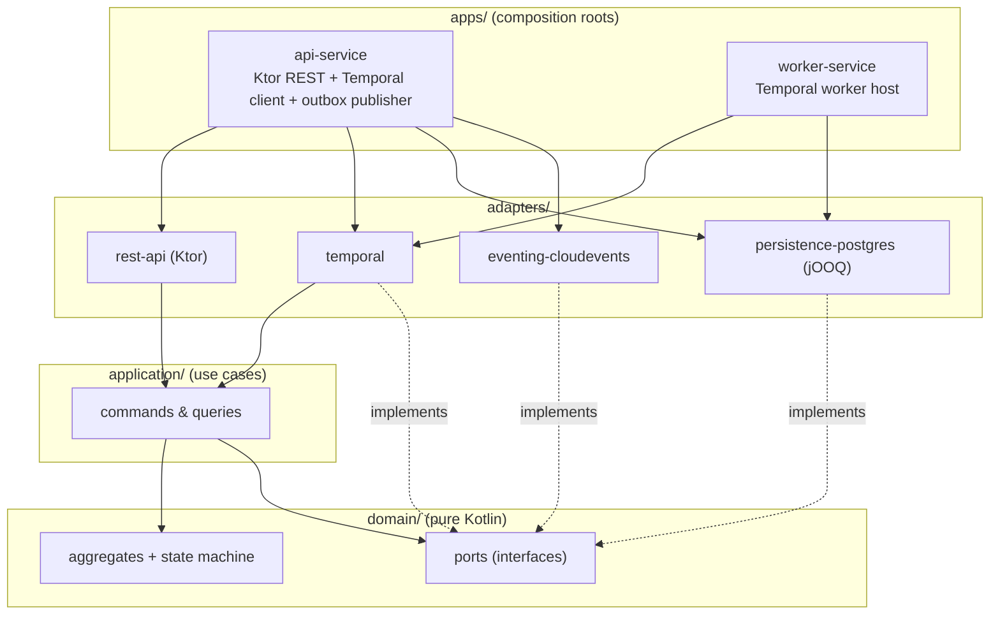
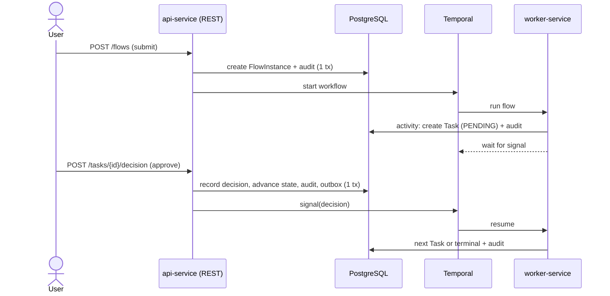

# Architecture Overview

wrkflw is a Kotlin/JVM Gradle multi-module monorepo built to **hexagonal (ports & adapters)**
architecture. The product is the *human-task domain* (flows, tasks, assignees, approvals,
audit); the durable orchestration substrate (**Temporal**) and the database (**PostgreSQL**)
are infrastructure behind ports.

## The layers

**Dependencies point inward only.** `domain` depends on nothing; `application` depends only on
`domain`; adapters depend on `application`/`domain` plus their own infrastructure library; the
two apps are the only modules that wire adapters to ports. A build-time boundary test
(Konsist/ArchUnit) fails the build if `domain` or `application` ever gain a Ktor/Temporal/jOOQ/
JDBC/DI dependency.

## Runtime flow (document approval)

The key split (**Approach A**): **Temporal owns orchestration position; PostgreSQL owns
human-task state, business data, and audit.** Human steps create DB rows and block on a Temporal
**signal**; REST actions validate domain rules, commit the authoritative DB transition, then
signal Temporal. See [Temporal integration](temporal-integration.md).

## Why these choices

- **Temporal, not a hand-built engine** — durability, retries, timers, and "wait for a human"
  for free; kept swappable behind the `WorkflowEngine` port. ([ADR-0002](../adr/0002-temporal-behind-a-port.md))
- **DB as the task source of truth** — work-list queries and admin operations stay simple SQL,
  and single-effective-decision is enforced with optimistic concurrency on `(status, version)`.
- **Transactional outbox + CloudEvents** — state and emitted events never disagree; integration
  events never drive internal progression (that is Temporal's job).
- **Ktor, not Spring** — constitution mandate; framework stays in the adapter/app layer only.

## Topology

Two deployables share `domain` + `application` + `persistence-postgres`:

- **api-service** — serves REST, sends Temporal signals, runs the outbox publisher.
- **worker-service** — hosts Temporal workflows and activities.

Both scale horizontally by running more instances. A web frontend is a later phase.
